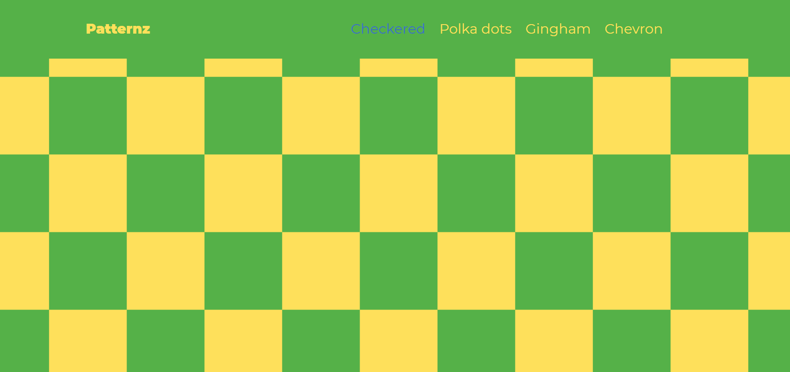

# LANDING PAGE PROJECT
The Landing page project is the second project in the Front End Nanodegree.

## GETTING STARTED
Udacity provides the files (HTML, CSS, JS) in their Github Page. Also, there's the option of starting from scratch.

## PREREQUISITES
A code editor of your choice and a strong drive.

## REQUIREMENTS
1. It should have dynamic navigation as an unordered list.
2. It should have an active state to the links corresponding to the current section.
3. It should scroll down smoothly to the location instead of jumping to it.

## LANGUAGES
* HTML.
* CSS.
* JavaScript.

## What I have Learned
1. How to manipulate the DOM.
2. How to use events listeners.
3. the logic behind the scrolling effect.
4. How to dynamically add content to the page.